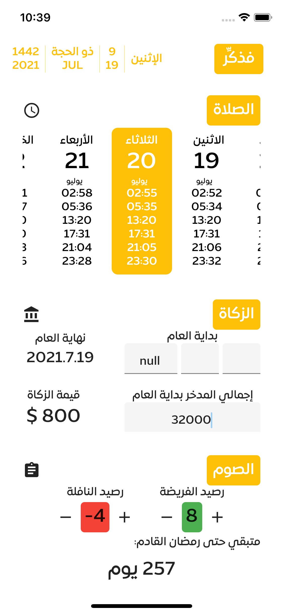

# Synopsis

Fthakker(in English: Remind) is an opensource flutter based Mobile app that is developed to retain good muslim-deeds. I initially started this project in late 2020 and expected to release a Beta version by Q4 in 2021. Any support is appreciated.

## Feature list:
Fthakker is still under development. But planned to support in the first release:
1. Prayer times
2. Zakah Calculations and Reminders (Obligatory annual donation in Islam)
3. Fasting reminders for what is missed and coming ones e.g. Ramadan
4. Daily Prayers

## Language support:
1. Arabic
2. English

# Snapshot

# Support
Feel free to create issues for suggestions or contact me directly at eng.a7med.sam@gmail.com

# Versions
- 0.0.1
